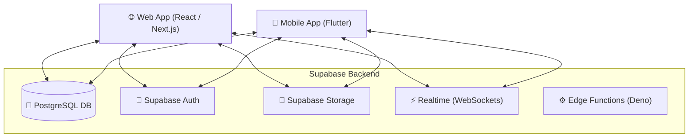
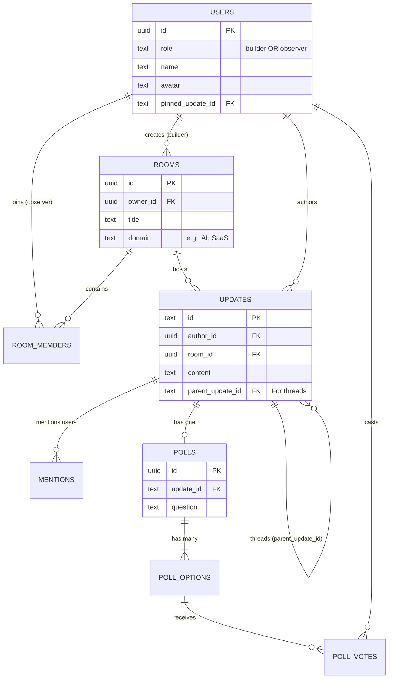

# Patchwork Architecture Overview

This document provides a high-level overview of the Patchwork platform's architecture, directory structure, and core data models.

## 1. High-Level Architecture

Patchwork is built as a unified platform supporting both mobile and web clients, powered by a scalable Backend-as-a-Service (BaaS).



### Technology Stack
- **Frontend (Web)**: React.js (Vite/Next.js) styled with Tailwind CSS and custom PostCSS animations. Uses React Query for data fetching/caching and Framer Motion for complex animations.
- **Frontend (Mobile)**: Flutter (Dart) using Provider/StatefulWidgets for state management and native Material/Cupertino widgets.
- **Backend**: Supabase (PostgreSQL). We utilize Row Level Security (RLS) for data protection, Remote Procedure Calls (RPCs) for atomic transactions (like poll voting), and Database Triggers for notifications.

---

## 2. Directory Structure

The repository is structured as a standard monorepo:

```text
PATCHWORK/
├── apps/
│   ├── web/                     # Web Application
│   │   ├── src/
│   │   │   ├── app/             # React Components & Pages
│   │   │   ├── hooks/           # Custom React Query hooks (e.g., useFeedUpdates)
│   │   │   └── styles/          # Tailwind, PostCSS, Fonts
│   │   ├── supabase/            # Backend configuration
│   │   │   ├── migrations/      # Sequential SQL schema migrations
│   │   │   └── functions/       # Edge functions (e.g., release notes generator)
│   │   └── package.json
│   │
│   └── mobile/                  # Flutter Mobile App
│       ├── lib/
│       │   ├── screens/         # Full-page UI views (Feed, Profile, Home)
│       │   ├── widgets/         # Reusable UI components (PollWidget, UpdateCard)
│       │   ├── services/        # API and Notification handlers
│       │   └── theme.dart       # Global styling & color tokens (e.g., primary500)
│       └── pubspec.yaml
```

---

## 3. Core Data Structure (Database Schema)

Patchwork's data model revolves around **Builders** sharing **Updates** in **Rooms**, and **Observers** providing **Reactions**.



### Key Entities:
1. **Users (`users`)**: Differentiated by `role` (Builders vs. Observers). Includes the newly added `pinned_update_id` to highlight specific milestones on their profiles.
2. **Rooms (`rooms`)**: Projects or domains created by Builders. Observers join rooms to receive updates.
3. **Updates (`updates`)**: The core content block (Feed post). It acts as the anchor for Reactions, Polls, and Threading (`parent_update_id`). Note: We use `TEXT` for Update IDs to maintain compatibility with legacy string generation.
4. **Interactions**:
   - **Mentions (`mentions`)**: Tracks `@username` tags for notifications.
   - **Polls (`polls`, `poll_options`, `poll_votes`)**: Structured feedback mechanism natively attached to an Update.

---

## 4. Current Scalability & Security Considerations

1. **Row Level Security (RLS)**: Every table has policies ensuring Observers can only view public rooms or rooms they've joined, and Builders can only edit their own updates.
2. **Realtime**: We heavily utilize Supabase's `pg_changes` via WebSockets. The mobile `HomeScreen` and web `useFeedUpdates` hooks listen to insert/update events to trigger local UI updates and push notifications.
3. **Atomic Operations**: Features like Poll voting are handled via Postgres RPCs (`vote_on_poll`) to prevent race conditions when multiple observers vote simultaneously.
